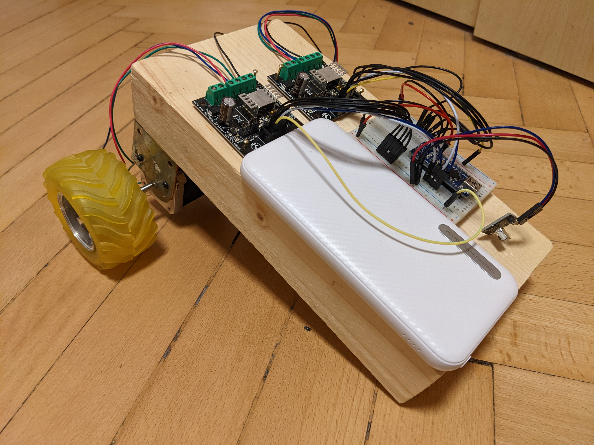

# REMOTE CONTROLLED CAR

### PROJECT FOLDERS:

 - car: code for arduino on the rc car
 - remote: code for stm32f7 board

### PARTS USED:

 - 2x 9V Battery
 
 - Power bank
 
 - IR transmitter
 
 - IR receiver TL1838
 	Datasheet - http://eeshop.unl.edu/pdf/VS1838-Infrared-Receiver-datasheet.pdf

 - 2x NEMA-17 Stepper motor (SY42STH47-1684B double shaft):
 	Product page - https://www.poscope.com/product/nema-17-sy42sth47-1684b-stepper-motor/
 	Schematics - https://www.poscope.com/wp-content/uploads/downloads/Motordrivers/Manuals/Nema17_SY42STH47-1684B.pdf
 	
 - 2x Bipolar Stepper Motor Driver – PoStep25-32:
 	Product page - https://www.poscope.com/product/postep25-32_stepper_motor_driver/
 	Manual - https://www.poscope.com/wp-content/uploads/downloads/Motordrivers/Manuals/PoStep25-32%20UserManual.pdf
 	Settings: full step, mixed decay, 0.5A
 	
 - Arduino Nano clone:
 	Product page - https://store.arduino.cc/products/arduino-nano
 
 - STM32f769i-disco:
 	Product page - https://www.st.com/en/evaluation-tools/32f769idiscovery.html
 	Reference manual - https://www.st.com/resource/en/reference_manual/rm0410-stm32f76xxx-and-stm32f77xxx-advanced-armbased-32bit-mcus-stmicroelectronics.pdf
 	Datasheet - https://www.st.com/resource/en/datasheet/stm32f767bi.pdf
 	

### LIBRARIES USED:

 - Official Arduino library
 - IRremote Arduino https://github.com/Arduino-IRremote/Arduino-IRremote
 - IRremote-STM32 https://github.com/MatejGomboc/IRremote-STM32
 - HAL, BSP, FreeRTOS, CMSIS

### WIRING:

<pre>
Battery  
  |  
Motor ----- Motor Driver -----  
                             |  
                             ----- Arduino Nano ----- IR receiver (((((((( IR transmitter ----- stm32f769i-disco  
                             |          |  
Motor ----- Motor Driver -----          |  
  |                                 Power bank  
Battery  
</pre>

### HOW IT WORKS:

Uporabnik se dotakne zaslona na dotik na stm32f769i-disco plošči in tako določi v smer premika avtomobila. Ukaz se prenese preko oddajnika infrardečega signala (uporablja se SIRC SONY protokol) in sprejme ga sprejemnik na avtomobilu. Prejeto sporočilo se prenese do Arduino Nano, ga intepretira in pošlje ustrezni signal gonilnikoma motorjev, ki zaženeta povezan motor.

